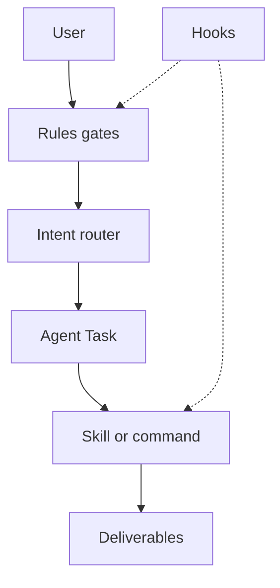
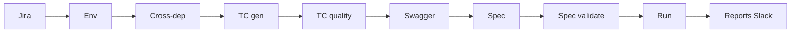

# Cursor workspace operating model

**Scope:** Orchestration (`.cursor/`) **and** how it connects to deliverables under `Cursor-Project/` (test cases, EnergoTS, reports).  
**Purpose:** Single reference for how the workspace **should** work after reconciliation (Phase 1–3).  
**Status:** **TARGET** design — not fully implemented in repo yet. See [§ Current vs target](#8-current-vs-target).  
**Related:** [WORKSPACE_PATTERNS.md](WORKSPACE_PATTERNS.md) · [RULES_CANONICAL_INDEX.md](RULES_CANONICAL_INDEX.md) · [../.cursor/README.md](../.cursor/README.md) · [../config/template/Slack_reporting_paths.md](../config/template/Slack_reporting_paths.md)

---

## 0. Why this workspace exists

This repository is **not** the Phoenix application. It is the **QA automation and validation control plane** for Phoenix delivery:

1. **Jira → test cases → Playwright API tests → reports** (HandsOff and related flows).
2. **Bug triage** with evidence (Confluence, Swagger, Phoenix code read-only, optional DB).
3. **Safe AI operation** — hooks and rules block Phoenix edits, Confluence writes, wrong EnergoTS branches, and silent environment guesses.

**Primary outputs:** `test_cases/`, `EnergoTS/tests/cursor/`, `reports/` (+ Slack uploads). **`.cursor/`** is the factory configuration; deliverables are the product.

---

## 1. Layer model (`.cursor/`)

Each layer has one job. **Do not duplicate procedure in rules.**

| Layer | Path | Responsibility | Must not |
|-------|------|----------------|----------|
| **Rules** | `.cursor/rules/**/*.mdc` | WHAT — obligations, gates, prohibitions, exit criteria | Full step-by-step workflows |
| **Skills** | `.cursor/skills/**/SKILL.md` | HOW — canonical procedure per workflow | Contradict paired agent or rules |
| **Agents** | `.cursor/agents/*.md` | WHO — Task subagent inputs/outputs | Duplicate skill steps |
| **Commands** | `.cursor/commands/*.md` + `.ps1` | RUN — checklists and scripts | Business logic duplication |
| **Hooks** | `.cursor/hooks/*.ps1` + `hooks.json` | ENFORCE — Tier A/B, MCP/shell guards | Orchestration |

### ASCII — request flow (always renders)

```
                    +------------------+
                    |  User / chat     |
                    +--------+---------+
                             |
                             v
              +------------------------------+
              |  Rules (alwaysApply + scoped) |
              +--------------+---------------+
                             |
                             v
              +------------------------------+
              |  Intent router               |
              |  phoenix-commands or INDEX   |
              +--------------+---------------+
                             |
         +-------------------+-------------------+
         |                   |                   |
         v                   v                   v
   +-----------+      +-----------+      +-----------+
   | Agent     |      | Agent     |      | Agent     |
   +-----+-----+      +-----+-----+      +-----+-----+
         |                   |                   |
         v                   v                   v
   +-----------+      +-----------+      +-----------+
   | SKILL     |      | SKILL     |      | commands/ |
   +-----------+      +-----------+      +-----------+
         ^                   ^                   ^
         +-------------------+-------------------+
                             |
              +--------------+---------------+
              |  Hooks (block / ask / remind) |
              +------------------------------+
                             |
                             v
              +------------------------------+
              |  Cursor-Project deliverables  |
              |  test_cases / EnergoTS / reports|
              +------------------------------+
```

### Mermaid — same flow (minimal syntax for preview)



---

## 2. Rules loading

### 2.1 Target: 6 always-on core bundles (Phase 3)

| Bundle | File(s) | Agent must apply |
|--------|---------|------------------|
| Core tiers & reports | `main/core_rules.mdc` | 0.6 chat-first; 0.8 Phoenix/EnergoTS tiers; 0.1 footer |
| Safety | `safety/safety_rules.mdc` | GitLab/Confluence read-only |
| Clarification | `main/clarification_and_confidence.mdc` | CONF.0 ask; CONF.1 score |
| Evidence | `main/evidence_only_project_answers.mdc` | Code > Confluence; Jira completeness |
| Workflow obligations | `workflows/workflow_rules.mdc` | Rules 32–44 **summary only** → link SKILL |
| Agents | `agents/agent_rules.mdc` | Routing; PhoenixExpert consultation |

### 2.1a Today vs target (`alwaysApply`)

| File | `alwaysApply` today | Target |
|------|---------------------|--------|
| `core_rules.mdc` | true | true |
| `safety_rules.mdc` | true | true |
| `clarification_and_confidence.mdc` | true | true |
| `evidence_only_project_answers.mdc` | true | true |
| `workflow_rules.mdc` | true | true |
| `agent_rules.mdc` | true | true |
| `phoenix.mdc` | true | merge into index / scope |
| `playwright_detailed_reporting.mdc` | true | true (DPR) or scoped to HandsOff globs |
| `file_organization_rules.mdc` | true | scoped (file writes) |
| `database_workflow.mdc` | true | scoped (DB MCP) |
| `jira_rest_fallback.mdc` | true | scoped (Jira reads) |
| `confluence_rest_fallback.mdc` | true | scoped (Confluence reads) |
| `jira_bug_agent.mdc` | true | scoped (Jira bug agent) |
| `production_data_reader.mdc` | true | scoped (PDR) |
| `test_cases_structure.mdc` | false + globs | false + globs |
| `handsoff_playwright_report.mdc` | false + globs | false + globs |
| `swagger_refresh_mandatory.mdc` | false + globs | false + globs |
| `phoenix_branch_switching.mdc` | false + globs | false + globs |
| `energots_branch_lock.mdc` | false + globs | false + globs |
| `no_auto_playwright_report_files.mdc` | none | **remove** (merge NPR into DPR) |

**Note:** Cursor injects all `alwaysApply: true` rules every session. Agents must still follow **target** loading mentally until Phase 3 reduces injection size.

### 2.2 Scoped (globs / explicit workflow)

| When | Rules | Procedure |
|------|-------|-----------|
| Test cases | `workspace/test_cases_structure.mdc` | cross-dep SKILL → test-case-generator SKILL |
| HandsOff / Playwright | `handsoff_playwright_report.mdc`, `swagger_refresh_mandatory.mdc`, `energots_branch_lock.mdc` | `commands/hands-off.md`, energo-ts-test agent |
| Bug validation | `phoenix_branch_switching.mdc`, integrations | **`phoenix-bug-validation` SKILL** (primary) |
| DB | `integrations/database_workflow.mdc` | `phoenix-database` SKILL |
| EnergoTS tree | `energots_branch_lock.mdc` | ENERGOTS.0 + hooks |

**Rule 0.0:** Before substantive work → [RULES_CANONICAL_INDEX.md](RULES_CANONICAL_INDEX.md) → canonical SKILL and/or agent.

---

## 3. Canonical truths (single source)

| Topic | Canonical | Deprecated / forbidden |
|-------|-----------|----------------------|
| TC preconditions | **STANDALONE** — full numbered chain per TC | DRY `Apply Test data steps 1–N` only |
| TC quality | **10 axes, ≥80/100**, max **3** rewrites | 6 axes, ≥8/12 |
| Playwright reports | **Smart** `{JIRA_KEY}.md` under `reports/HandsOff reports/…` **+ machine** `EnergoTS/playwright-report-detailed.md` for Slack (DPR.0) | NPR “never EnergoTS/” — merge/remove |
| JSON/HTML reports | Input only | Primary deliverable |
| EnergoTS git branch | **`cursor` only** | checkout main/dev/test in EnergoTS |
| Playwright setup | Helpers + `test.step('Precondition:…')` | `test.beforeAll` (Rule 40) |
| Swagger | Run `update-swagger-specs.ps1` before `.spec.ts` | Guessed field names |
| Environment | User picks 1 of 6 envs | Silent default to Test |
| Frontend TC files | Only if user chose Yes (TC-FRONTEND-ASK.0) | HandsOff forcing both files |

---

## 4. Intent cheat sheet

| User intent | Agent | Skill / command | Top rules |
|-------------|-------|-----------------|-----------|
| Phoenix Q&A | `phoenix-qa` | `phoenix-agent-workflow` | 0.2, evidence |
| Validate bug | `bug-validator` | `phoenix-bug-validation` | 32, 41, PHOENIX-SWITCH |
| Resolve environment | `environment-resolver` | **missing** — use [environment-resolver.md](../.cursor/agents/environment-resolver.md) until Phase 2 skill | CONF.0, TC-ENV, DB.0a |
| Cross-dependencies | `cross-dependency-finder` | `cross-dependency-finder` | 35a, 39 |
| Generate test cases | `test-case-generator` | `test-case-generator` | 35, STANDALONE |
| Score test cases | `test-case-quality-validator` | `test-case-quality-validator` — **sync to 10-axis in Phase 1** | rubric 10-axis |
| Full HandsOff | `hands-off` | `commands/hands-off.md` | 37, DPR |
| Write Playwright spec | `energo-ts-test` | **missing** — use [energo-ts-test.md](../.cursor/agents/energo-ts-test.md) until Phase 2 skill | 0.8.1, 41, 40 |
| Validate spec | `playwright-test-validator` | **missing** — use [playwright-test-validator.md](../.cursor/agents/playwright-test-validator.md) until Phase 2 skill | handsoff §2a |
| Run Playwright | `energo-ts-run` | `energo-ts-run` | 36, ENERGOTS.0 |
| Scoped Playwright + Slack | parent or energo-ts-run | `send-playwright-results-slack.md` | DPR, path 3 |
| DB query | `database-query` | `phoenix-database` | 33, DB.0a |
| Production DB read | `production-data-reader` | `production-data-reader` | PDR.0 |
| Jira bug text (Experiments) | `jira-bug` | `jira-bug-template` | JIRA.0 |
| Postman collection | `postman-collection` | — (stub agent) | 8, PhoenixExpert |
| Dev portal access | `environment-access` | — (stub agent) | Rule 10 |
| Save report / feedback | `report-generator` | `phoenix-reporting` | 0.6 — Chat reports or Feedback |
| Which workflow? | — | `phoenix-commands` | 0.0 |

**Every reply:** `Agents involved:` (0.1) + `Confidence: XX%` (CONF.1).

---

## 5. Workflow diagrams

**Full checklists:** `.cursor/commands/hands-off.md` (HandsOff), `.cursor/skills/phoenix-bug-validation/SKILL.md` (Rule 32).

### 5.1 Test cases (Rule 35) — ASCII

```
[1] TC-ENV-ASK.0     AskQuestion: dev|dev2|test|preprod|prod|experiments
        |
[2] TC-FRONTEND      Backend only OR Backend+Frontend
        |
[3] PHOENIX-SWITCH   switch-phoenix-branches.ps1 (if Phoenix reads needed)
        |
[4] cross-dep        Jira + code + shallow Confluence (35a)
        |
[5] test-case-gen    Backend/Topic.md (+ Frontend/Topic.md if step 2 = Yes)
                     STANDALONE preconditions each TC
        |
[6] quality gate     10-axis >= 80 per TC (max 3 rewrites)
        |
      DONE
```

### 5.2 HandsOff (Rule 37) — ASCII (aligned with hands-off.md)

```
Step 1   Jira fetch (42, 44) + environment-resolver + switch-phoenix-branches.ps1
Step 2   cross-dependency-finder (35a)
Step 3   test-case-generator
           - Backend/Topic.md always
           - Frontend/Topic.md only if TC-FRONTEND-ASK.0 = Yes
Step 3.5 test-case-quality-validator (mandatory, >= 80/100)
Step 4   update-swagger-specs.ps1 + energo-ts-test -> tests/cursor/*.spec.ts
Step 4.5 playwright-test-validator (mandatory before run)
Step 5   energo-ts-run (cursor branch, Rule 36)
Step 6   {JIRA_KEY}.md -> reports/HandsOff reports/YYYY/month/DD/
         + generate-detailed-report.mjs -> EnergoTS/playwright-report-detailed.md
Step 7   Slack path 2: short text + upload BOTH .md (Tester + #ai-report)
Step 8   Agent follow-up questions (attributed), after report

Canonical detail: .cursor/commands/hands-off.md
```

### 5.3 Bug validation (Rule 32) — ASCII

```
env gate (STOP if unknown)
  -> phoenix align
  -> swagger refresh (mandatory)
  -> Confluence broad (Rule 32 ONLY — not Rule 39 scope)
  -> Phoenix code read-only
  -> DB optional SELECT same env
  -> 5 verdicts in chat
  -> Slack path 1: bug-validation channel (C0AUEEDVCEL) when MCP allows
  -> Disk BugValidation_*.md ONLY on /report or explicit save (Rule 0.6)

EXCLUDED: test cases, Playwright, HandsOff
```

### 5.4 Scoped Playwright Slack (path 3) — ASCII

```
User asks Slack for specific test run (not full HandsOff)
  -> energo-ts-run (or existing spec)
  -> generate-detailed-report.mjs if JSON exists
  -> ScopedPlaywright_*.md -> reports/Chat reports/YYYY/month/DD/
  -> Slack path 3: short text + upload smart .md + playwright-report-detailed.md

Does NOT run cross-dep or test-case generation unless user asks separately.
Command: .cursor/commands/send-playwright-results-slack.md
```

### 5.5 Mermaid — HandsOff (10 nodes)



---

## 6. Deliverables map

| Artifact | Path | Persist? | Slack path |
|----------|------|----------|------------|
| Backend TCs | `Cursor-Project/test_cases/Backend/<Topic>.md` | Yes | — |
| Frontend TCs | `Cursor-Project/test_cases/Frontend/<Topic>.md` | If TC-FRONTEND = Yes | — |
| Playwright spec | `Cursor-Project/EnergoTS/tests/cursor/<KEY>-*.spec.ts` | Yes | — |
| HandsOff smart report | `Cursor-Project/reports/HandsOff reports/YYYY/month/DD/{KEY}.md` | Yes | **Path 2** upload |
| Scoped Playwright report | `Cursor-Project/reports/Chat reports/YYYY/month/DD/ScopedPlaywright_*.md` | If user scoped Slack | **Path 3** upload |
| Chat report (`/report`) | `Cursor-Project/reports/Chat reports/YYYY/month/DD/*.md` | User `/report` or explicit save | Only if user asks |
| Feedback (`/feedback`) | `Cursor-Project/reports/Feedback/YYYY/month/DD/Feedback_*.md` | User `/feedback` | — |
| Machine report | `Cursor-Project/EnergoTS/playwright-report-detailed.md` | Generated (DPR) | **Path 2 or 3** upload |
| Playwright JSON | `Cursor-Project/EnergoTS/playwright-report.json` | Ephemeral input | — |
| Bug validation | Chat default | Optional `BugValidation_*.md` on `/report` | **Path 1** channel |
| Routine Q&A | Chat only | No auto file (Rule 0.6) | — |

**Slack index:** [config/template/Slack_reporting_paths.md](../config/template/Slack_reporting_paths.md) — three paths; do not merge.

---

## 7. Hooks enforcement map

| Rule | Hook script | Event | Status today | Target |
|------|-------------|-------|--------------|--------|
| JIRA.0 Experiments only | `block-jira-phoenix-delivery.ps1` | beforeSubmitPrompt | Wired | Wired |
| TC-ENV remind | `remind-test-case-env-first.ps1` | beforeSubmitPrompt | Wired (non-blocking) | Wired |
| ENERGOTS.0 prompts | `block-energots-branch-requests.ps1` | beforeSubmitPrompt | **Not wired** | Phase 1 |
| Phoenix Tier A | `protect-phoenix-code.ps1` | beforeFileEdit | Wired | Wired |
| EnergoTS Tier B | `protect-energots-writes.ps1` | beforeFileEdit | **File planned** | Phase 2 |
| Confluence read-only | `block-confluence-write.ps1` | beforeMCPExecution | Wired | Wired |
| DB writes | `control-database-write.ps1` | beforeMCPExecution | Wired | Wired |
| Git push | `control-git-push.ps1` | beforeShellExecution | Wired | Wired |
| ENERGOTS.0 shell | `block-energots-branch-switch.ps1` | beforeShellExecution | **Not wired** | Phase 1 |

**Invariant:** If a rule cites a hook, that hook **must** appear in `hooks.json` or the rule must say “rules-only (no hook).”

**Today:** `energots_branch_lock.mdc` claims hooks enforce ENERGOTS.0 — scripts exist but are **not** in `hooks.json` (Phase 1).

---

## 8. Current vs target

| Area | Current (repo today) | Target (this doc) | Phase |
|------|----------------------|-------------------|-------|
| TC preconditions | DRY and STANDALONE both CRITICAL | STANDALONE only | 1 |
| TC quality skill | 6-axis / 8/12 in SKILL | 10-axis / 80 sync with agent | 1 |
| Reports | NPR vs DPR conflict | DPR + smart report; NPR removed | 1 |
| EnergoTS hooks | Scripts exist, not in hooks.json | Wired | 1 |
| HandsOff Frontend | Always both files in hands-off.md | Respect Backend-only | 1 |
| alwaysApply rules | ~14 files | ~6 core + scoped | 3 |
| Agent/skills README | Gaps (quality-validator, 3 skills) | Full 1:1 matrix | 2 |
| warn-phoenix hook | Over-broad path match | Match protect-phoenix paths only | 2 |
| Missing skills | 3 agents without SKILL | Add thin SKILL routers | 2 |
| This document §8 | Gap list | Rows marked DONE as phases complete | ongoing |

---

## 9. Reconciliation phases

| Phase | Days (estimate) | Outcome |
|-------|-----------------|---------|
| **1 Truth** | 1–2 | NPR→DPR; STANDALONE canonical; TC quality skill sync; wire EnergoTS hooks; HandsOff Backend-only |
| **2 Registry** | 2–3 | README indexes; 3 new skills; `protect-energots-writes.ps1`; fix warn-phoenix |
| **3 Slim** | ongoing | Dedupe Rule 35 text; reduce alwaysApply; `validate-cursor-consistency.ps1` |

**Exit criterion Phase 1:** no pair of CRITICAL rules contradict on TC preconditions, reports, or rubric.

**After each phase:** update §7 Status/Target columns and §8 — move completed rows to “Done” or delete the current column when repo matches target.

---

## 10. Diagram usage

- **Prefer ASCII** in chat and runbooks — renders everywhere.
- **Mermaid in this file:** only `flowchart TD/LR`, ≤10 nodes, ASCII labels, no `subgraph`, no `gantt`, no `sequenceDiagram`.
- **Preview:** Open in Cursor/VS Code markdown preview or GitHub.

---

## 11. Document maintenance

| When | Action |
|------|--------|
| Phase 1 merged | Update §8; set §7 EnergoTS hooks to Wired; remove NPR from §2.1a |
| Phase 2 merged | Add skill paths to §4; update `.cursor/skills/README.md` link |
| New mandatory workflow | Add row to RULES_CANONICAL_INDEX + §4 cheat sheet + §2.2 |
| Rule contradiction found | Fix rules first; then §3 canonical truths; then this doc |

**Self-score target for this file:** ≥90/100 when Phase 1 repo changes match §8 “Target” column.

---

*Last updated: 2026-05-31 — workspace operating model (orchestration + deliverables).*
