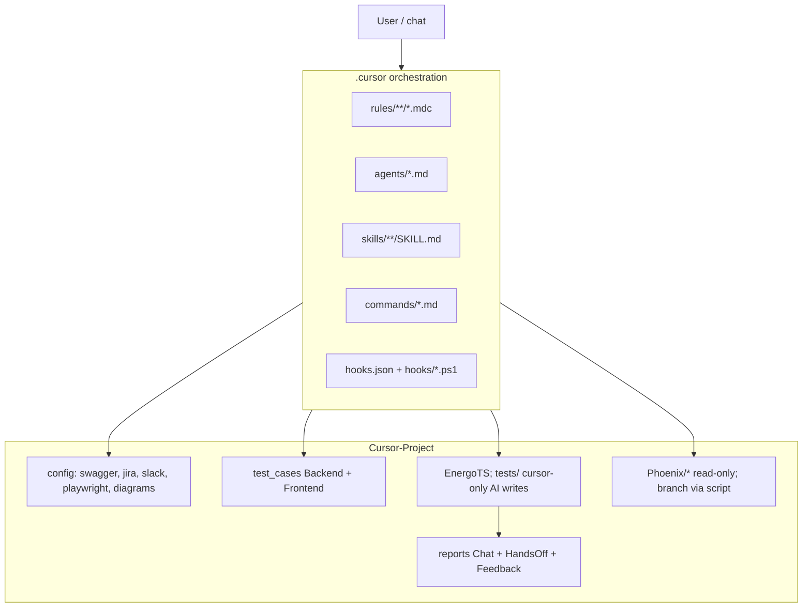

# Workspace work patterns (canonical)

This document describes **how this repository is intended to be used**: layout, dominant flows, tooling, and quality gates. It is derived from the actual **`.cursor/`** orchestration and **`Cursor-Project/`** deliverable layout. For rule-to-file mapping, see **`RULES_CANONICAL_INDEX.md`**. For **target** `.cursor/` layer flow, intent routing, and diagrams (ASCII + minimal Mermaid), see **`CURSOR_OPERATING_MODEL.md`**.

## 1. Repository layout

| Area | Path | Role |
|------|------|------|
| Orchestration | **`.cursor/`** at **git workspace root** (sibling of `Cursor-Project/`) | Rules (`.mdc`), agents, skills, commands, hooks |
| Deliverables & assets | **`Cursor-Project/`** | `config/`, `docs/`, `scripts/`, `test_cases/`, `reports/`, `EnergoTS/`, `Phoenix/` mirrors, templates |
| User stories | **`User story/`** at workspace root (if present) | Story and flow files (English only for persisted text) |

Orientation: `.cursor/README.md`.

## 2. Dominant work patterns

### 2.1 Environment-gated Phoenix reads

Before environment-sensitive Phoenix work (Q&A, bug validation, cross-dependencies, test-case generation, HandsOff), align every nested repo under `Cursor-Project/Phoenix/*` to the correct `origin/<branch>` using **`switch-phoenix-branches.ps1`**. Phoenix files remain **read-only** for AI (Tier A); see **`core_rules.mdc`** Rule 0.8 and **`phoenix_branch_switching.mdc`**.

### 2.2 Jira-centric pipelines

Issue keys drive **HandsOff** (Rule 37), **bug validation** (Rule 32), and **test-case generation** (Rule 35).

- **Reads:** Jira **MCP first**; on repeated failure, **Atlassian REST API v3** read fallback — **`jira_rest_fallback.mdc`** (Rule 42). Disclose `Jira source: REST fallback …` in chat when used.
- **Attachments:** **`Cursor-Project/config/jira/download-jira-attachments.ps1`** when content analysis is required.

### 2.3 Quality chain (automation)

Typical ordered chain:

1. **TC-ENV-ASK.0** — environment (`environment-resolver` / AskQuestion) **before** Frontend question and Phoenix reads  
2. **TC-FRONTEND-ASK.0** — Backend only vs Backend+Frontend (when applicable)  
3. Phoenix branch alignment (`switch-phoenix-branches.ps1`)  
4. **cross-dependency-finder** (mandatory before test cases; Rule 35a)  
5. **test-case-generator** → `test_cases/Backend/` and optionally `Frontend/`  
6. **test-case-quality-validator**  
7. **energo-ts-test** (Playwright authoring — agent-only writes under `EnergoTS/tests/`)  
8. **playwright-test-validator**  
9. **energo-ts-run** (Rule 36: `cursor` branch only)

**Swagger:** Before creating or editing EnergoTS `.spec.ts`, run **`update-swagger-specs.ps1`** (Rule 41).

### 2.4 Evidence and diagrams

- **Project answers:** code > Confluence — **`evidence_only_project_answers.mdc`**.  
- **Diagrams:** Local library **`Cursor-Project/config/Diagrams/`**; linked assets under **`Cursor-Project/config/confluence/diagrams/<pageId-or-issueKey>/`** when downloadable. Bug vs task diagram policy: **`phoenix-bug-validation/SKILL.md`**, **`test-case-generator/SKILL.md`**.

### 2.5 Reporting and Slack

- **Default:** answers in **chat**; no new report files unless HandsOff, `/report`, `/feedback`, or explicit user save — **Rule 0.6** in **`core_rules.mdc`**.  
- **Paths and uploads:** **`Cursor-Project/config/template/Slack_reporting_paths.md`**, **`playwright_detailed_reporting.mdc`**, **`handsoff_playwright_report.mdc`**.

### 2.6 Safety and enforcement

**`hooks.json`** and **`hooks/*.ps1`** align with Tier A/B (no Phoenix edits; restricted EnergoTS writes). See **`safety_rules.mdc`**.

## 3. Rules loading model (operational)

1. **Always:** Cursor injects `alwaysApply: true` rules — treat them as binding.  
2. **Before substantive work** on a workflow: read the **canonical** SKILL and/or agent file for that workflow (see **`RULES_CANONICAL_INDEX.md`**), plus linked integration rules.  
3. **Full audit** of every `.mdc`: when the user requests a rules audit, when running **`Cursor-Project/scripts/validate-cursor-rules.ps1`**, or when editing rules broadly.

## 4. Diagram (high level)

## 5. Maintenance and validation

- **Static checks:** `powershell -ExecutionPolicy Bypass -File "Cursor-Project/scripts/validate-cursor-rules.ps1"` from repo root (resolves `../..` from `scripts/`). The script **fails** on missing **`.cursor/`** path references inside `.cursor/rules/**/*.mdc`. Missing **`Cursor-Project/...`** paths are **warnings** only (rules often cite illustrative examples that are not committed).  
- **Optional Jira batch helper:** `Cursor-Project/scripts/jira_bug_validator.py` — configure via environment variables documented in **`Cursor-Project/config/jira/README.md`** (no secrets in repo docs).

## Appendix A — Parity review (doc vs repo)

Use this checklist after substantive rule or script changes:

| Check | Expected |
|-------|----------|
| `WORKSPACE_PATTERNS.md` | Matches sections 1–5 above; update when new mandatory workflows appear |
| `RULES_CANONICAL_INDEX.md` | Each new CRITICAL workflow row has a canonical SKILL or agent |
| `validate-cursor-rules.ps1` | Passes on CI / locally |
| `.gitignore` | Jira export paths ignored per policy in `config/jira/README.md` |

## Appendix B — Pattern evolution (before vs after this optimization pass)

| Dimension | Before | After |
|-----------|--------|-------|
| Single “how we work” doc | Absent; patterns scattered across rules, skills, agents | **`WORKSPACE_PATTERNS.md`** + **`RULES_CANONICAL_INDEX.md`** |
| Rule 0.6 vs index | **`phoenix.mdc`** quick reference incorrectly said “always generate reports” | Aligned with **`core_rules.mdc`** 0.6 (chat-first; disk only when mandated/explicit) |
| Rule 0.0 | Required reading every `.mdc` before any action (not credible operationally) | **Tiered model:** alwaysApply + workflow canon + full scan only for audits/CI/broad rule edits |
| Drift control | Duplication across `workflow_rules.mdc` and SKILLS without a map | **`RULES_CANONICAL_INDEX.md`** + workflow file points to canon |
| Validation | Path checks mainly from one file | **All** `.cursor/rules/**/*.mdc` internal `.cursor/` and `Cursor-Project/` path refs scanned |
| `jira_bug_validator.py` | Hardcoded machine path, base URL, project | **Env-driven** defaults with repo-root discovery; documented in **`config/jira/README.md`** |
| Jira export hygiene | Large/issue JSON could sit in working tree without policy | **`config/jira/attachments/`** ignored by default; README explains redacted samples |

---

*Last updated: optimization pass per internal plan “Raise workspace score 8+”. Chat replies may be non-English; persisted project text stays English (Rule 0.7).*
